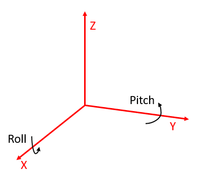
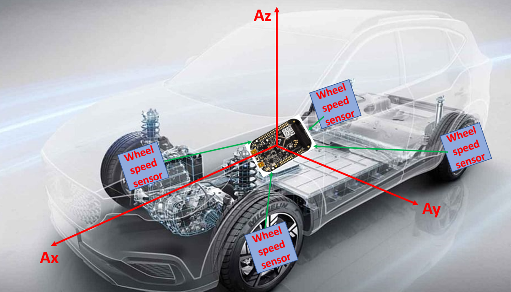
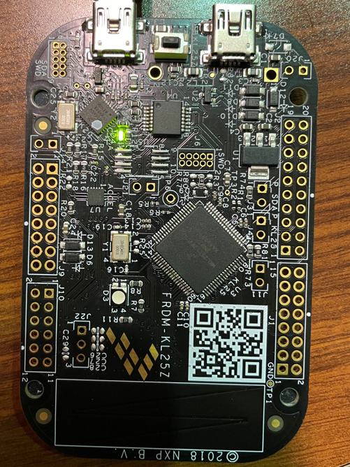
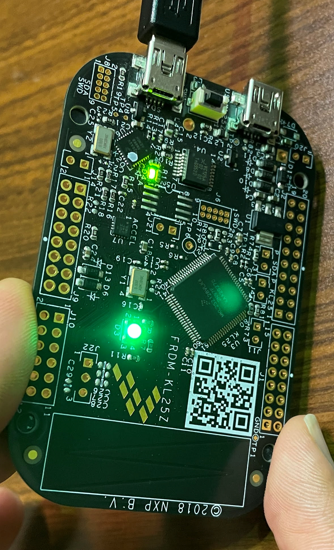
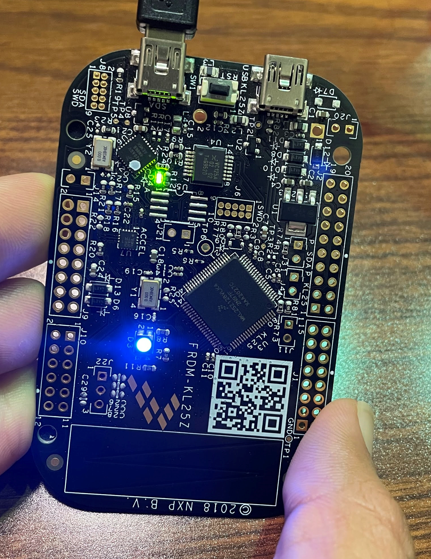
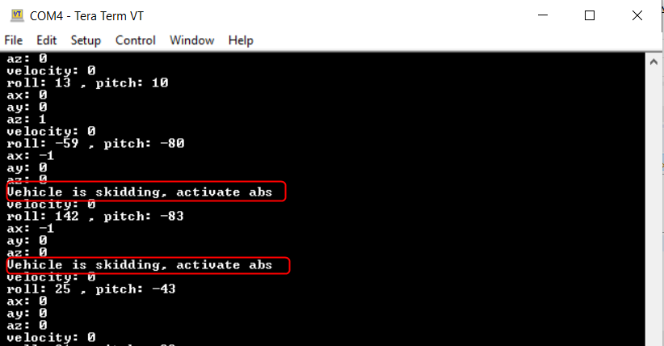

# Inertial-Sensor-Signal-Processing: 

This Repository contains code for the ECEN 5813 PES FINAL PROEJECT for FALL 2021 which is implemented on FRDM KL25Z.

Special thanks to @howdypierce for all lectures.

## Objective : 
To implement MMA8451Q , on-board inertial sensor over I2C for orientation and motion detection(acceleration) on KL25Z.

While attempting to implement the above objective, the idea of skid detection also emerged, the below project description explains the idea behind skid detection. 

## Project Concept : 

###  Orientation :

The above picture shows the Roll and Pitch calculation around the axis. 

The formulas to convert the acceleration values to pitch and roll are as follows.
Roll = atan2(aY, aZ) * 180/PI;
Pitch = atan2(aX, sqrt(aY*aY + aZ*aZ)) * 180/PI;

### Skid Detection :

As per the above picture, KL25Z will be receiving wheel speed values continuosly from the wheel speed sensor and It will be comparing the same with its own accelerometer (Ax) readings. As soon as wheel speed sensor reading becomes "0" but still on board accelerometer if showing some value, Then it is decided that the vehicle is skidding. This is the principle behind skid detection.

## Testing Strategy : 
1. Test functions are written for Queue module and I2C module which will be executed after initialization of each module.
2. Manual testing has to be done for MMA8451Q Sensor. 
   1. On Flat surface in standstill position:
             Ideal values : Pitch - 0
                            Roll  - 0
                            Ax,Ay - 0
                            Az    - 1 (in terms of g)
                            LEDs behavior : Ideally all LEDs should be in OFF state.(SMALL level of brightness can be seen due to uncalibrated sensor)
                           Refer the below picture 
                       
   2. Tilt the board in horizontal direction :
           Expected values : Pitch - 0
                             Roll - depends on the tilt
                             LEDs : Green LED PWM can be seen
                             Refer the below picture 
                       
   3. Tilt  the board in vertical direction :
           Expected values : Pitch - depends on the tilt
                             Roll - 0
                             LEDs : Blue LED PWM can be seen
                             Refer the below picture 
                       
   4. Sudden Acceleration (Since other sensor value is zero, Skidding is detected.
                            Expected behavior : LEDs start flashing.
                       

Reference :  1. https://github.com/sunsided/frdm-kl25z-marg-fusion/blob/master/frdm-kl25z-acc-uart/Sources/i2c
             2. https://github.com/alexander-g-dean/ESF/blob/master/NXP/Code/Chapter_8/I2C-Demo/src
             3. https://github.com/sunsided/frdm-kl25z-marg-fusion/blob/master/frdm-kl25z-acc-uart/Sources
             4. Text Book : Embedded Systems Fundamentals with ARM Cortex-M based Microcontrollers: A Practical Approach FRDM-KL25Z Edition 
            
            
             
